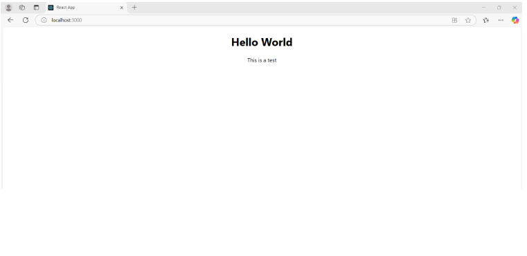

We are introduced to node js and react app by installing and upgrading the 
packages and creating the hello world app. 

Node.js 

Node.js is like a magic tool that helps to build applications and websites 

using Javascript for both frontend and backend.  

●  Normally, JavaScript is used only on the front end. 
●  Node.js allows you to use JavaScript on the back end (server side) too. 
●  This means you can use the same language (JavaScript) for both front end 

and back end, making development simpler. 

●  Node.js is very fast and efficient. 
●  It makes javascript run very fast. 
●  Node.js has a huge library of ready-made tools (called NPM packages) 

that you can use to add features quickly without writing everything from 
scratch. 

React 

Node.js and React are both related to JavaScript, but they serve different 

purposes and work on different parts of a web application. 

●  React is a JavaScript library used to build user interfaces (UIs) — the part 

of the app that the user sees and interacts with. 

●  It helps us to create dynamic and responsive websites or apps (like 

updating content without refreshing the page). 

Working together of Node.js and React 

1.  React builds the front-end user interface (the “face” of the app). 
2.  Node.js processes the data and sends it back to React to display. 

🎯 Example: 

●  You open a social media app (React). 
●  You type a comment and press "Post." 
●   React sends the comment to a Node.js server. 
●   Node.js saves it to a database and confirms it was successful.  

 
 
 
 
 
 
 
●   React updates the comment section with your new comment — without 

refreshing the page. 

DOM 

DOM stands for Document Object Model. 

●  When a browser loads a webpage, it creates a structured representation of 

the HTML file in the form of a tree. 

●  This tree-like structure is called the DOM. 
●  It allows you to access and modify web page elements using JavaScript. 
●  You can create dynamic web pages (like updating content without 

refreshing). 

●   It helps in handling user interactions (like button clicks or form 

submissions). 

●  Here we are using the virtual DOM which is a lightweight copy of the 

real DOM. 

In Simple Terms: 

●  DOM = A tree structure representing the webpage. 
●  Problem = Changing it directly is slow. 
●  Solution = Virtual DOM (React, Vue) speeds it up by updating only the 

changed parts. 

●  Future Trends = Tools like Svelte and WebAssembly may reduce the 

need for direct DOM updates. 

 
 
 
 
 
 
 
 
 
Let us understand with the help of code 

●  Here we are just printing the hello world and test. 

Output: 

 
 
 
 
●  Next creating the counter.js file and importing in app.js 
 

●  In the app.js add the line 

○  import Counter from ‘./Counter’; 
○  After 
 tag add one more <Counter /> 

Output 

●  This is the initial stage. If we click on increment it will increase and if we 
click on decrement it will decrease and if we click on reset it will become 
0. 

 
 
 
 
 
 
 
 
Increment: 

Decrement: 

Reset: 

 
 
 
 
 
 
 
●  Next created a todo.js where we can add our tasks and displayed it in the 

server from app.js 

●  Explanation of code 

a.  The purpose of useState is to store the input and todos. 
b.  The function addTodo adds todo in the list and trims the extra 

spaces. 

c.  Here onChange captures the input value and map displays todos. 
d.  The key keeps the item in the list unique. 

 
 
 
 
 
 
●  In the app.js add the line 

○  import Todo from ‘./Todo’; 
○  After <Counter /> add <Todo /> 

Output 

 
 
 
 
 
 
 
 
 
 
●  Next created a ThemeSwitcher.js where we are having a button and by 
using this we can switch the mode and displayed it in the server from 
app.js 

●  Here we are using the function ThemeSwitcher and this function will 

handle the component switching the light and dark modes. 

●  The toogleTheme function is used if the theme is light it switches to dark 

or if it is in dark it switches to light. 

●  Renders the UI and in that we are having a button, When the button is 

clicked, the toggleTheme() function is called. 

●  In the app.js add the line 

○  import ThemeSwitcher from ‘./ThemeSwitcher’; 
○  After <Todo /> add <ThemeSwitcher /> 

 
 
 
 
 
 
 
 
 
 
Output 

The default 

If we click on the button Dark Mode it switches the mode from light to dark 
only for the buttons 

 
 
 
 
 
 
 
●  Next applied the theme switch for the whole page by modifying the small 

change in ThemeSwitcher.js file. 

●  Here the modification we have made is changing the button to body. So it 

switches the entire body. 

●  The default will be the light theme and I am providing the dark theme 

output. 

 
 
 
 
 
●  Next created a table.js file where we are taking inputs from the user and 

displaying it on the server side by app.js. 

 
 
 
 
 
Flow of execution 

1.  User types name and email. 
2.  Values are stored in the state using handleInputChange. 
3.  On clicking "Add Row": 

a.  The values are added to the rows array. 
b.  The table updates automatically to show the new data. 

●  In the app.js add the line 

○  import Table from ‘./Table’; 
○  After <ThemeSwitcher /> add <Table /> 

Output 

 

●  If we enter the details and click on the Add Row button then the output 

will be displayed. 

 
 
 
●  Next we worked on routes. We created two files Home.js and about.js, 
where those two files are the pages and displaying the output and 
switching the routes from app.js as well as index.js. 
●  Here providing all the files that are used for routes. 

App.js : 

Index.js :  

 
 
Home.js : 

About.js: 

 
 
 
 
 
 
 
Flow of Execution 

1.  index.js 

○  Renders App.js inside a BrowserRouter. 
○  Routing is enabled via BrowserRouter. 

2.  App.js 

○  Renders the header and other imported components. 
○  Defines the available routes using Routes and Route. 

3.  When the User Visits /home: 

○  The Home component is rendered. 
○  Clicking the "About" button calls navigate('/about'), triggering the 

router to switch to /about. 

4.  When the User Visits /about: 

○  The About component is rendered. 

5.  Dynamic Behavior: 

○  Counter, Todo, ThemeSwitcher, and Table are always visible since 

they are outside the Routes component. 

a.  index.js → Wraps App.js in BrowserRouter 
b.  App.js → Imports and renders Counter, Todo, ThemeSwitcher, Table 
c.  App.js → Configures routes for Home and About 
d.  Home.js → Uses useNavigate() to switch routes 
e.  About.js → Static page rendered based on the route 

●  The output will be the same and we want to traverse the pages to get the 

desired output. The screen will be the same but while traversing the pages 
it will be added a button depending on the page. If we want a separate 
screen for every page then we need to work to give it as routes. 

 
 
 
 
 
 
Default  

●  If we traverse to Home, by entering /home in URL 

➢ Here we can observe the button About, it appears because we have 

mentioned the button About and if we click that it traverses to the About 
page. 

 
 
 
 
 
 
●  We can achieve it directly by entering /about in the URL. In the about/js 

file we haven’t mentioned any functionality so it displayed as About text. 

Now converted everything as components and switching the pages, the screen 
will be different for every page. 

 
 
 
React App 

/counter 

 
 
 
 
 
/todo 

/themeswitcher 

 
 
 
 
 
/table 

/home and /about pages are the same as above. 

●  In the afternoon session we worked on our project and brush up all the 

topics covered on the morning session. 

 
 
 
 
 
